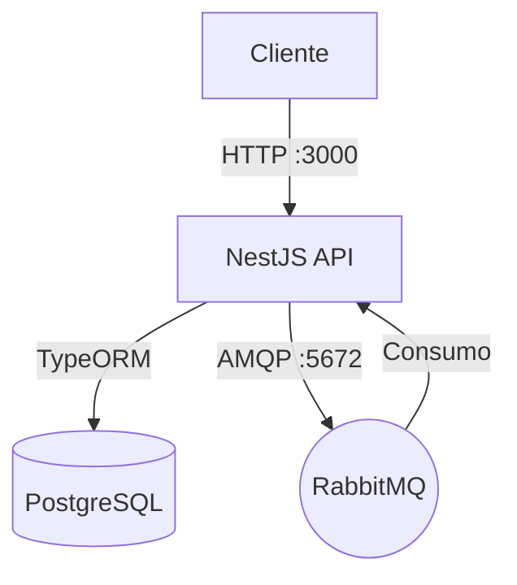

# Omni Messenger

Projeto NestJS containerizado com PostgreSQL e RabbitMQ.

## Requisitos

- Docker
- Docker Compose

## Configuração do Ambiente

Copie o arquivo de exemplo `.env-example` para `.env` e ajuste as variáveis conforme necessário.

```bash
cp .env-example .env
```

## Execução

### Modo de Desenvolvimento (Padrão)

Ideal para desenvolvimento local com hot-reload (alterações no código refletem imediatamente).

1. Certifique-se de que no `.env` as variáveis estão configuradas para dev:
   ```env
   NODE_ENV=development
   BUILD_TARGET=development
   ```
2. Inicie os serviços:
   ```bash
   docker-compose up --build
   ```

### Modo de Produção

Ideal para deployment, com imagem otimizada e sem ferramentas de desenvolvimento.

1. Altere as variáveis no `.env` para produção:
   ```env
   NODE_ENV=production
   BUILD_TARGET=runner
   ```
2. Inicie os serviços (o build usará multi-stage para gerar uma imagem leve):
   ```bash
   docker-compose up --build -d
   ```

## Comandos Úteis

- Parar serviços: `docker-compose down`
- Logs em tempo real: `docker-compose logs -f app`
- Rebuild forçado: `docker-compose up --build --force-recreate`

## Arquitetura



## Serviços

- **app**: API NestJS (Porta 3000)
- **postgres**: Banco de dados (Porta interna 5432)
- **rabbitmq**: Mensageria (Porta 5672 AMQP, 15672 Management)

## Endpoints Principais

A documentação interativa via Swagger está disponível em:
`http://localhost:3000/api`

### Mensagens
- **POST /messenger/text**: Envio de mensagem de texto.
- **POST /messenger/document**: Envio de documento.
- **POST /messenger/bulk-send**: Envio em massa com rate limiting (30 msgs/10s).
- **GET /messenger/history**: Histórico de mensagens.

### Usuários
- **POST /users**: Criação de usuário.
- **GET /users**: Listagem de usuários.
- **GET /users/:id**: Detalhes do usuário.
- **PUT /users/:id**: Atualização de usuário.
- **DELETE /users/:id**: Remoção lógica (soft delete).

### Agendamento (Scheduling)
- **POST /professionals**: Criação de profissional.
- **GET /professionals**: Listagem de profissionais.
- **PATCH /professionals/:id**: Atualização de profissional.
- **DELETE /professionals/:id**: Remoção lógica.
  - *Nota*: Ao remover um profissional, todos os seus agendamentos futuros são cancelados automaticamente e os clientes notificados via mensagem.

### Autenticação Google Calendar
- **GET /auth/google-calendar/auth/:professionalId**: Inicia o fluxo OAuth2 para um profissional.
- **GET /auth/google-calendar/callback**: Callback para salvar os tokens do profissional.

Para detalhes sobre a arquitetura do módulo de mensagens (Z-API, Factory Pattern, SOLID), consulte:
[Documentação do Módulo Messenger](docs/MESSENGER_MODULE.md)

## Testes

Executar testes unitários:
```bash
npm run test
```

Executar testes E2E:
```bash
npm run test:e2e
```

## Detalhes de Implementação

### Envio em Massa (Bulk Send)
O endpoint `/messenger/bulk-send` implementa um mecanismo de controle de taxa (rate limiting) na camada de aplicação:
- **Lotes**: As mensagens são divididas em grupos de 30.
- **Intervalo**: Há um atraso de 10 segundos entre o processamento de cada lote.
- **Monitoramento**: Logs detalhados são gerados para cada lote e mensagem processada.
- **Resiliência**: Falhas no enfileiramento de uma mensagem não interrompem o processamento do lote.

### Retry Policy (RabbitMQ)
Atualmente, o consumidor processa a mensagem e, em caso de falha na API externa (Z-API):
1. O erro é capturado e logado.
2. O status da mensagem no banco de dados é atualizado para `FAILED`.
3. A mensagem é removida da fila (ACK) para evitar loops infinitos.
*Para ambientes de produção, recomenda-se a configuração de Dead Letter Exchanges (DLX) para retentativas com backoff exponencial.*

## Configuração do Google Calendar
