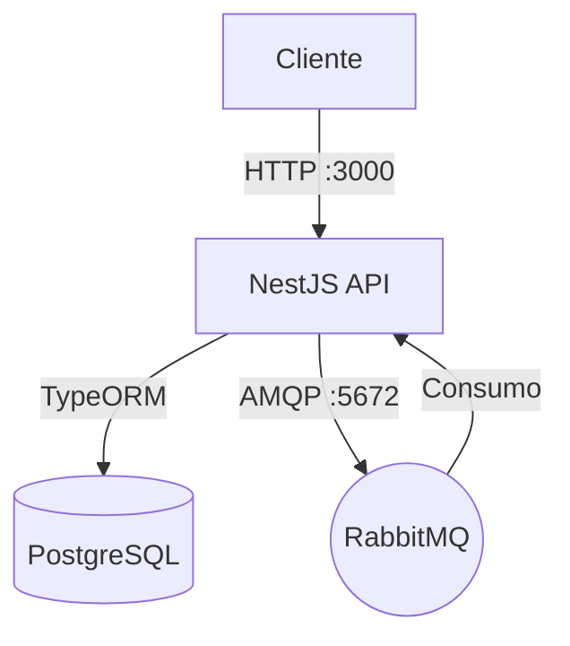

# Omni Messenger

Projeto NestJS containerizado com PostgreSQL e RabbitMQ.

## Requisitos

- Docker
- Docker Compose

## Execução

Para iniciar todos os serviços:

```bash
docker-compose up --build
```

Para parar os serviços:

```bash
docker-compose down
```

## Arquitetura



## Serviços

- **app**: API NestJS (Porta 3000)
- **postgres**: Banco de dados (Porta interna 5432)
- **rabbitmq**: Mensageria (Porta 5672 AMQP, 15672 Management)

## Desenvolvimento

O projeto utiliza:
- NestJS (Framework)
- TypeORM (ORM)
- RabbitMQ (Mensageria)
- Docker (Containerização)

A configuração de conexão com o banco de dados e RabbitMQ é feita via variáveis de ambiente no `docker-compose.yml`.
